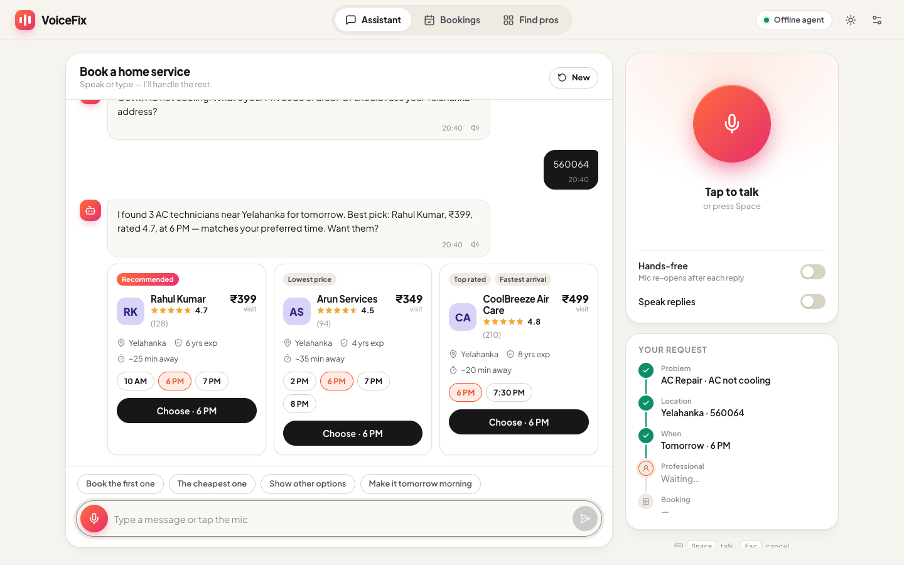
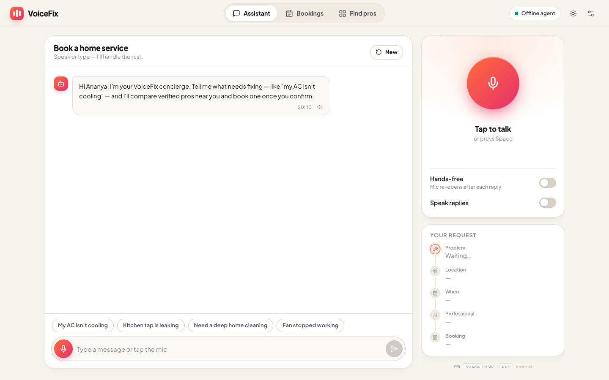
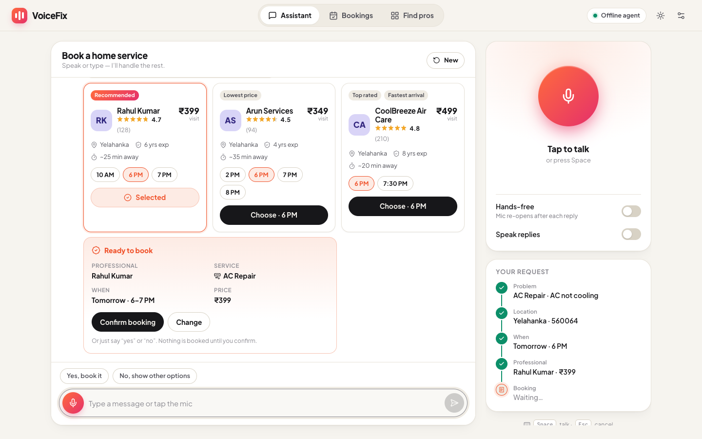
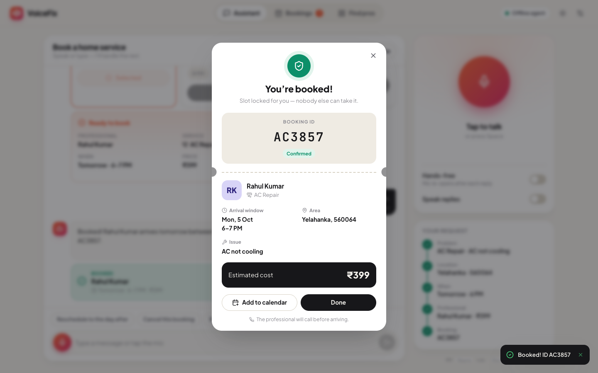
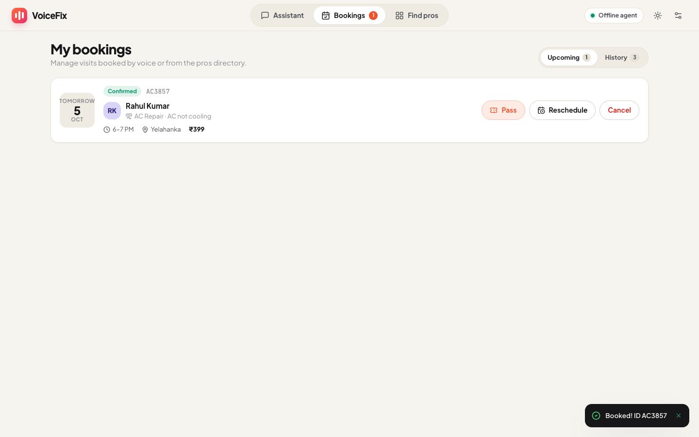
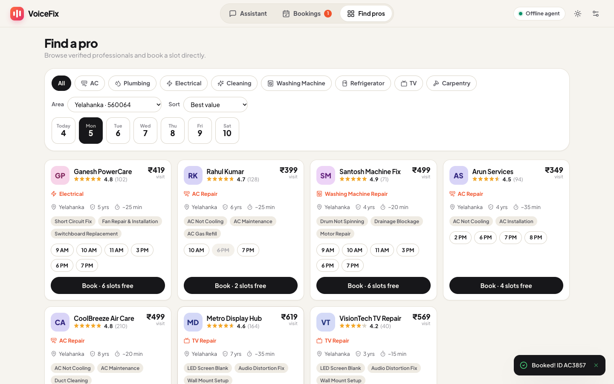
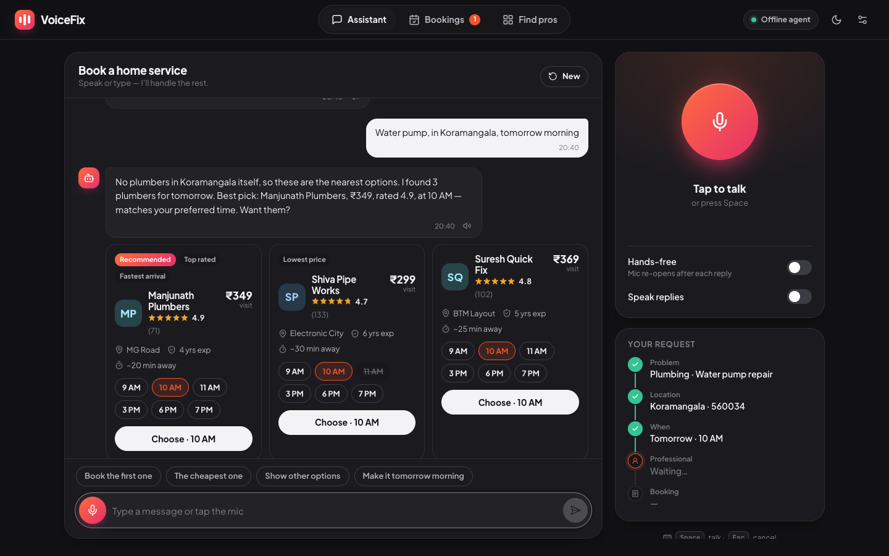
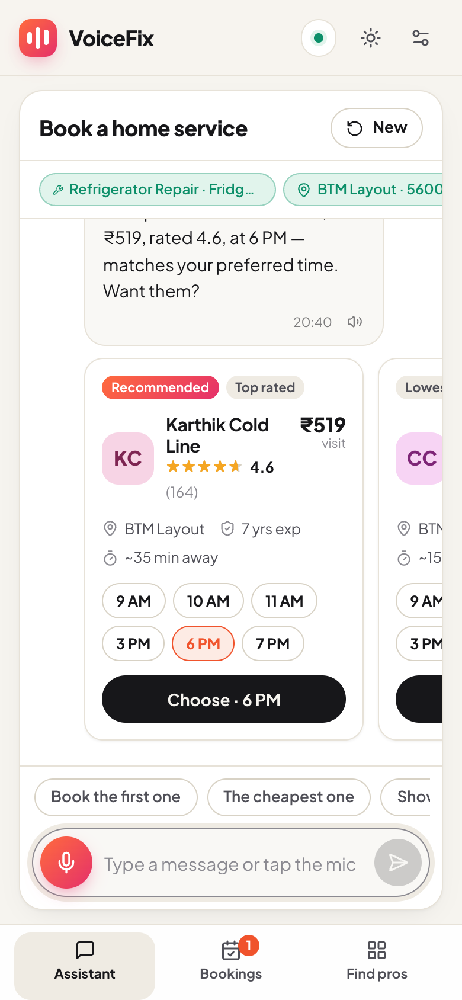

# VoiceFix — Voice-First Home Service Booking (PS-06)

Talk to an AI concierge to book a home-service professional. Say what's wrong ("my AC isn't cooling"), and it asks only for what's missing (PIN code or area, day, time). It then compares real providers, **asks you to confirm**, and books the slot atomically so the same slot can never be booked twice.



## Screenshots

| | |
| --- | --- |
|  **Assistant**: voice orb, live request tracker, suggested replies |  **Comparison**: real providers, ratings, prices, tappable time slots |
|  **Explicit confirmation**: nothing is booked until you say or tap "yes" |  **Booking pass**: booking ID, arrival window, add to calendar |
|  **My bookings**: upcoming and history, reschedule, cancel |  **Find pros**: filter by category, area and day, then book directly |
|  **Dark mode**: off-topic requests are declined politely, and vague ones ("my motor") get one clarifying question |  **Mobile**: swipeable cards, bottom navigation, full-screen listening sheet |

## What this project does

**Voice conversation**
- Speech-to-text with live captions in the browser (Chrome, Edge, Safari), plus an optional ElevenLabs Scribe path for other browsers.
- Spoken replies in the most natural voice your browser has, or ElevenLabs Flash voices.
- An animated orb that reacts to your mic level.
- Hands-free mode, where the mic re-opens after each reply. You can also interrupt the agent mid-reply.
- Press <kbd>Space</kbd> to talk and <kbd>Esc</kbd> to cancel.
- Short, voice-friendly replies of one or two sentences. Full details stay on screen.

**Three choices of agent "brain"** (Settings → Agent)
- **Claude AI agent** (`claude-opus-5-5`): natural conversation backed by booking tools. Used automatically when `ANTHROPIC_API_KEY` is set.
- **Offline agent**: rule-based and instant, with no API key. It understands English and Hinglish ("kal shaam", "AC thanda nahi kar raha"), PIN codes (including spoken digits like "five six zero zero six four"), area names, relative dates and times.
- **Make.com AI Agent**: forwards each turn to your Make scenario's webhook.

If Claude or Make fails, the offline agent answers, so the conversation never dead-ends.

**Booking flow and safety**
- Detects missing details and asks for one thing at a time. It can use the customer's saved address.
- Ranks providers by how close they are to your preferred time, then by value (rating weighed against price), and badges the cards Recommended, Top rated, Lowest price or Fastest arrival.
- **Explicit confirmation is enforced in code**:
  - The offline agent books only after a "yes" (spoken, typed or tapped).
  - The Claude agent must propose first, and its confirm tool refuses to run in the same turn as the proposal.
- **No double booking.** Each booking is checked and saved in one uninterrupted step, so when concurrent requests try the same slot, exactly one succeeds. The others get `409 SLOT_UNAVAILABLE` plus alternative slots.
- Reschedule and cancel work by voice ("move it to Wednesday morning", "cancel my booking") or from the Bookings page. Both ask for confirmation first.

**App**
- Pages: Assistant, My bookings, and Find pros (a directory with direct booking).
- Light, dark and system themes, a responsive mobile layout, and accessible labels and focus handling.
- Availability rolls forward with the calendar (a 14-day window built from each provider's daily schedule), so the demo never goes stale.
- Express serves the API and the built React app on one port. It deploys to Render or Docker.

## Quick start

```bash
npm run setup     # installs root, API and frontend dependencies; creates .env
npm run dev       # API on :8000 + web app on http://localhost:5173
```

Open **http://localhost:5173**, tap the orb (or press <kbd>Space</kbd>) and try:

1. "My AC isn't cooling properly. I need someone tomorrow evening."
2. "Use my saved address" (or "560064")
3. "Yes, Rahul Kumar" (or tap a time slot)
4. "Yes, book him." → you get a booking pass with the ID

Then try "reschedule it to Wednesday morning", "cancel my booking" or "what are my bookings?".

## Configuration (`.env`, all optional)

| Variable | Purpose |
| --- | --- |
| `ANTHROPIC_API_KEY` | Enables the Claude AI agent. Without it the offline agent is used. |
| `CLAUDE_MODEL` | Overrides the model (default `claude-opus-5-5`). |
| `MAKE_WEBHOOK_URL` | The Make.com webhook used in **Make.com AI Agent** mode. |
| `ELEVENLABS_API_KEY`, `ELEVENLABS_VOICE_ID`, `ELEVENLABS_MODEL_ID` | ElevenLabs speech-to-text and voices (default model `eleven_flash_v2_5`). Keys stay on the server and are never sent to the browser. |
| `APP_TIMEZONE` | Sets what "today" means and the booking window. Default `Asia/Kolkata`. |
| `DATA_DIR` | Where runtime bookings are stored. Default `mock-api/data/runtime/`. |
| `ALLOW_RESET` | Allows `POST /api/admin/reset` in production. |

## Scripts

| Command | What it does |
| --- | --- |
| `npm run dev` | API (tsx watch) + Vite dev server with an `/api` proxy |
| `npm test` | 55 tests: API, booking concurrency, offline agent, Claude agent (mocked) and language parsing |
| `npm run typecheck` | TypeScript checks for both packages |
| `npm run build && npm start` | Production build; Express serves the app and API on :8000 |
| `docker compose up --build` | Same thing in a single container on :8000 |

## How it works

```
Mic ─► SpeechRecognition / ElevenLabs STT ─► POST /api/agent/message
                                               │
         ┌──── mode=auto/claude ───────────────┼──── mode=local ────┬──── mode=make ────┐
         ▼                                     ▼                    ▼                   │
  Claude + booking tools              Offline agent (NLU +    Make.com webhook          │
  (search, propose, confirm)          dialogue state machine)  └─ falls back ◄──────────┘
         │                                     │
         └──────────► ProviderService / BookingService (rolling availability, atomic booking)
                                               │
Reply {text, stage, state, options, proposal, booking, suggestions}
   ─► React cards + text-to-speech
```

## Limitations

- **Demo data, not a real marketplace.** There are 44 fictional providers in 8 Bengaluru PIN codes, with hourly slots and flat visit prices. There are no payments, SMS or email notifications, and no real provider app.
- **No authentication.** The customer is chosen from demo profiles in Settings. Anyone who can open the app can view, cancel or reset bookings. CORS is open and there is no rate limiting. Harden all of this before any real deployment.
- **Simple storage.** Bookings live in one JSON file served by a single Node process. The no-double-booking guarantee holds for one server instance only; multiple instances would need a real database with transactions. Render's free tier has an ephemeral disk, so bookings reset on each deploy.
- **The offline agent is rule-based.** It covers common booking phrasing in English and Hinglish but can misread unusual sentences. It always replies in English, even when it understands Hindi or Kannada input.
- **The Claude agent needs an API key and costs money per conversation.** Its conversation history lives in server memory and is lost on restart. It has been tested with a simulated API in the automated tests; verify it against the live API once your key is in place.
- **Voice depends on the browser.**
  - Speech recognition needs Chrome, Edge or Safari, an internet connection (Chrome sends audio to Google), and `localhost` or HTTPS.
  - Firefox needs an ElevenLabs key for voice input.
  - Voice quality varies with the voices installed on your device.
  - Real microphone use is not covered by the automated tests.
- **Make.com mode depends on your scenario.** The scenario must end with a Webhook Response module that returns JSON with a `text` field. When the app falls back to the offline agent, the conversation so far isn't carried over.
- **Fixed scope.** There's one timezone (Asia/Kolkata), a 14-day booking window, and same-day slots need at least 1 hour's notice.

## Project layout

```
frontend/               React + Vite + TypeScript UI
  src/hooks/useAssistant.ts   conversation + voice state machine
  src/lib/speech.ts           recognition, recorder fallback, TTS, voice ranking
  src/components/, src/views/ Assistant, Bookings, Find pros
mock-api/               Express + TypeScript API
  src/agent/                  nlu.ts, agent.ts (offline), claudeAgent.ts (Claude + tools)
  src/services/               availability, providers, bookings
  src/routes/                 REST, agent, voice proxy, config
  tests/                      Vitest suites
make/                   Make.com scenario guide, prompt, tool schemas
docs/                   Setup, API reference, architecture, demo script, screenshots
```

See [docs/setup.md](docs/setup.md) for deployment and [docs/api.md](docs/api.md) for the REST API.
