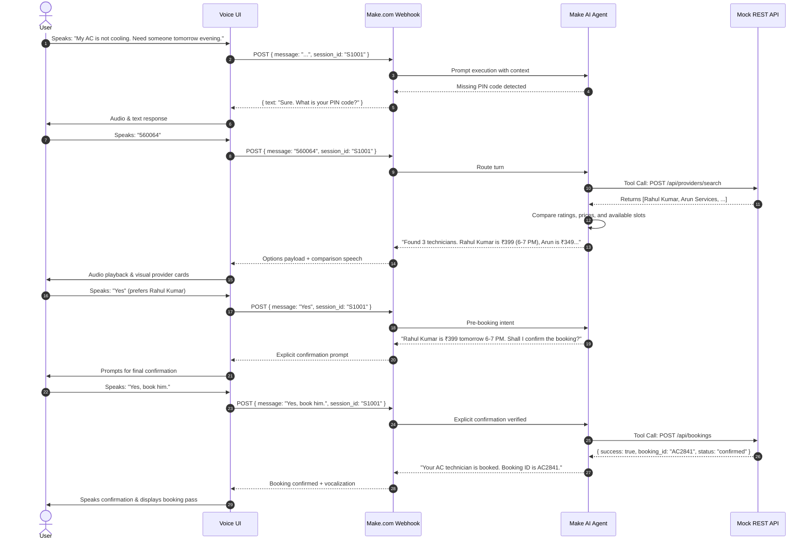

# Make.com Primary Orchestration Architecture

This document describes the architectural flow where **Make.com serves as the central orchestration and AI agent layer** for the PS-06 Voice Service Booking Agent.

---

## 1. High-Level Architecture Flow

```
+-------------------------------------------------------------------------+
|                              USER CLIENT                                |
|  - Voice Input (Microphone via MediaRecorder / Web Audio)               |
|  - Local Speech-To-Text (Browser SpeechRecognition or ElevenLabs STT)    |
|  - Modern Visual UI (Transcripts, Option Cards, Booking Badge)          |
|  - Local Audio Playback (SpeechSynthesis / ElevenLabs TTS)              |
+-------------------------------------------------------------------------+
                                    │
                                    │ HTTP POST (JSON)
                                    ▼
+-------------------------------------------------------------------------+
|                        MAKE.COM SCENARIO WEBHOOK                        |
|  - Endpoint: https://hook.eu1.make.com/...                              |
|  - Ingestion: { session_id, customer_id, message, language }           |
+-------------------------------------------------------------------------+
                                    │
                                    │ Routes conversation turn
                                    ▼
+-------------------------------------------------------------------------+
|                       MAKE.COM AI AGENT MODULE                          |
|  - Model Context & Prompts: ai-agent-prompt.md                          |
|  - Intent Extraction: Problem Category, Date, Time, PIN Code            |
|  - Deduplication: Never re-asks known information                       |
|  - Missing Data Detection: Identifies absent PIN code or date           |
|  - Comparison Logic: Ranks providers by Rating, Price, ETA, Slots       |
|  - Confirmation Enforcement: Rejects automatic bookings                 |
+-------------------------------------------------------------------------+
                                    │
            Tool Invocations via HTTP Make Modules (REST)
                                    │
         ┌──────────────────────────┴──────────────────────────┐
         ▼                                                     ▼
+───────────────────────────────+     +──────────────────────────────────+
|  PROVIDER API (/api/providers)|     |   BOOKING API (/api/bookings)    |
|  - Deterministic filtering    |     |  - Atomic slot locking           |
|  - Real-time availability     |     |  - Dynamic Booking ID generation |
|  - Exact & nearest matches    |     |  - Double-booking prevention     |
+───────────────────────────────+     +──────────────────────────────────+
         │                                                     │
         └──────────────────────────┬──────────────────────────┘
                                    ▼
+-------------------------------------------------------------------------+
|                    MAKE NOTIFICATION & RETURN LAYER                     |
|  - Make Data Store: Updates session history and context                 |
|  - Notification Module: SMS/Email trigger for confirmed bookings        |
|  - Webhook Response: Returns formatted voice text & metadata            |
+-------------------------------------------------------------------------+
                                    │
                                    ▼
                               USER VOICE
```

---

## 2. Conversational Sequence Diagram


